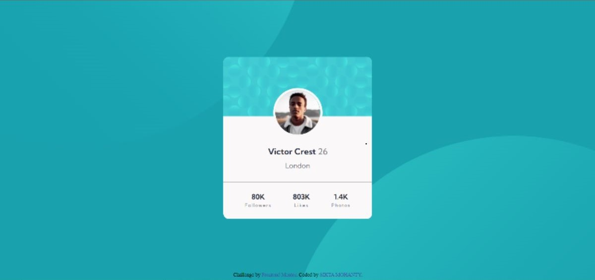

# Frontend Mentor - Profile card component solution

This is a solution to the [Profile card component challenge on Frontend Mentor](https://www.frontendmentor.io/challenges/profile-card-component-cfArpWshJ). Frontend Mentor challenges help you improve your coding skills by building realistic projects. 

## Table of contents

- [Website](#website)
- [Screenshot](#screenshot)
- [Overview](#overview)
  - [The challenge](#the-challenge)
  - [Resources](#resources)
  - [Links](#links)
  - [Built with](#built-with)
- [Author](#author)

## Website

WEBSITE: <a href="https://sikta2002.github.io/Profile_card_component-Frontend-Mentor/">Click here</a>

## Screenshot

## Overview

### The challenge

- Challenge is to build out a profile card component and get it looking as close to the design as possible.
- Good challenge to test out layout skills.

### Resources

- Our task is to build out the project to the designs inside the `/design` folder.
- We can find all the required assets in the `/images` folder.
- `style-guide.md` file containing the information we'll need, such as color palette and fonts.

### Links

- Solution URL: [Frontend Mentor Submission](https://www.frontendmentor.io/solutions/profile-card-component-FBWpkakqjK)
- Live Site URL: [Active GitHub Page](https://sikta2002.github.io/Profile_card_component-Frontend-Mentor/)

### Built with

- Semantic HTML5 markup
- CSS custom properties
- Flexbox

## Author

- Website: <a href="https://github.com/Sikta2002">Sikta Mohanty</a>
- Frontend Mentor - <a href="https://www.frontendmentor.io/profile/Sikta2002">@Sikta2002</a>
- Twitter - <a href="https://twitter.com/moonsikta">@moonsikta</a>
